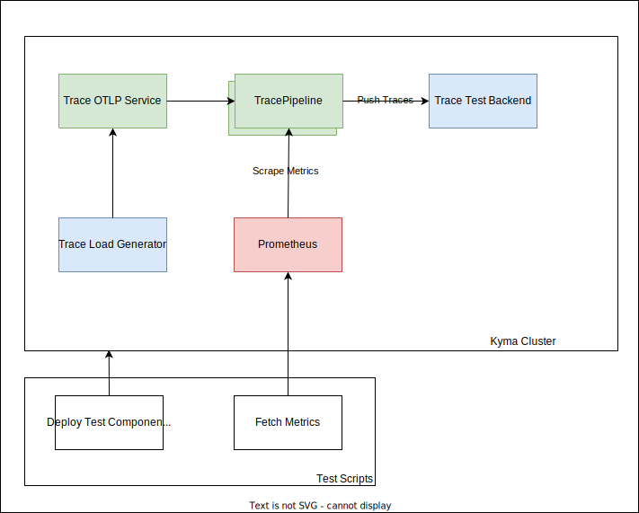
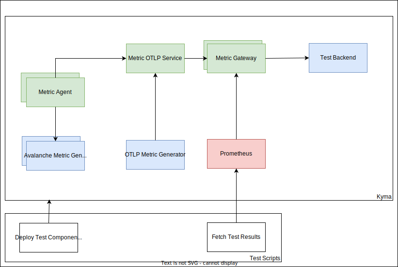

# Telemetry KPIs and Limit Test

This document describes a reproducible test setup to determine the limits and KPis of the Kyma TracePipeline and MetricPipeline.

## Prerequisites

- Kyma as the target deployment environment, 2 Nodes with 4 CPU and 16G Memory (n1-standard-4 on GCP)
- Telemetry Module installed
- Istio Module installed
- Kubectl > 1.22.x
- Helm 3.x
- curl 8.4.x
- jq 1.6

## Test Script

All test scenarios use a single test script [run-load-test.sh](assets/run-load-test.sh), which provides following parameters: 

- `-t` The test target type supported values are `traces, metrics, metricagent, logs-fluentbit`, default is `traces`
- `-n` Test name e.g. `0.92`
- `-m` Enables multi pipeline scenarios, default is `false` 
- `-b` Enables backpressure scenarios, default is `false`
- `-d` The test duration in second, default is `1200` seconds 

## Traces Test 

### Assumptions

The tests are executed for 20 minutes, so that each test case has a stabilized output and reliable KPIs. Generated traces contain at least 2 spans, and each span has 40 attributes to simulate an average trace span size.  

The following test cases are identified:

1. Test average throughput end-to-end. 
2. Test queuing and retry capabilities of TracePipeline with simulated backend outages.
3. Test average throughput with 3 TracePipelines simultaneously end-to-end.
4. Test queuing and retry capabilities of 3 TracePipeline with simulated backend outages.

Backend outages simulated with Istio Fault Injection, 70% of traffic to the Test Backend will return `HTTP 503` to simulate service outages.

### Setup

The following diagram shows the test setup used for all test cases. 



In all test scenarios, a preconfigured trace load generator is deployed on the test cluster. To ensure all trace gateway instances are loaded with test data, the trace load generator feeds the test TracePipeline over a pipeline service instance .

A Prometheus instance is deployed on the test cluster to collect relevant metrics from trace gateway instances and to fetch the metrics at the end of the test as test scenario result.

All test scenarios also have a test backend deployed to simulate end-to-end behaviour.

Each test scenario has its own test scripts responsible for preparing test scenario and deploying on test cluster, running the scenario, and fetching relevant metrics/KPIs at the end of the test run. After the test, the test results are printed out.

A typical test result output looks like the following example:

```shell
|          |Receiver Accepted Span/sec  |Exporter Exported Span/sec  |Exporter Queue Size |    Pod Memory Usage(MB)    |    Pod CPU Usage     |
|   0.92   |           5992             |           5993             |           0        |        225, 178            |        1.6, 1.5      |
```

### Running Tests

1. To test the average throughput end-to-end, run:

```shell
./run-load-test.sh -t traces -n "0.92"
```
2. To test the queuing and retry capabilities of TracePipeline with simulated backend outages, run:

```shell
./run-load-test.sh -t traces -n "0.92" -b true
```

3. To test the average throughput with 3 TracePipelines simultaneously end-to-end, run:

```shell
./run-load-test.sh -t traces -n "0.92" -m true
```

4. To test the queuing and retry capabilities of 3 TracePipelines with simulated backend outages, run:

```shell
./run-load-test.sh -t traces -n "0.92" -m true -b true
```

### Test Results


<div class="table-wrapper" markdown="block">

| Version/Test |       Single Pipeline       |                             |                     |                      |               |       Multi Pipeline        |                             |                     |                      |               | Single Pipeline Backpressure |                             |                     |                      |               | Multi Pipeline Backpressure |                             |                     |                      |               |
|-------------:|:---------------------------:|:---------------------------:|:-------------------:|:--------------------:|:-------------:|:---------------------------:|:---------------------------:|:-------------------:|:--------------------:|:-------------:|:----------------------------:|:---------------------------:|:-------------------:|:--------------------:|:-------------:|:---------------------------:|:---------------------------:|:-------------------:|:--------------------:|:-------------:|
|              | Receiver Accepted Spans/sec | Exporter Exported Spans/sec | Exporter Queue Size | Pod Memory Usage(MB) | Pod CPU Usage | Receiver Accepted Spans/sec | Exporter Exported Spans/sec | Exporter Queue Size | Pod Memory Usage(MB) | Pod CPU Usage | Receiver Accepted Spans/sec  | Exporter Exported Spans/sec | Exporter Queue Size | Pod Memory Usage(MB) | Pod CPU Usage | Receiver Accepted Spans/sec | Exporter Exported Spans/sec | Exporter Queue Size | Pod Memory Usage(MB) | Pod CPU Usage |
|         0.91 |            19815            |            19815            |          0          |       137, 139       |     1, 1      |            13158            |            38929            |          0          |       117, 98        |   1.3, 1.3    |             9574             |            1280             |         509         |      1929, 1726      |   0.7, 0.7    |            9663             |            1331             |         510         |      2029, 1686      |   0.7, 0.7    |
|         0.92 |            21146            |            21146            |          0          |        72, 50        |     1, 1      |            12757            |            38212            |          0          |       90, 111        |   1.3, 1.1    |             3293             |            2918             |         204         |       866, 873       |   0.6, 0.6    |            9694             |            1399             |         510         |      1730, 1796      |   0.7, 0.7    |
|         0.93 |            19708            |            19708            |          0          |        69, 62        |     1, 1      |            12355            |            37068            |          0          |       158, 140       |   1.5, 1.2    |             319              |             324             |         237         |      874, 1106       |    0.1, 0     |            8209             |             865             |         510         |      1755, 1650      |   0.4, 0.4    |


</div>


## Metrics Test

The metrics test consists of two main test scenarios. The first scenario tests the Metric Gateway KPIs, and the second one tests Metric Agent KPIs.

### Metric Gateway Test and Assumptions

The tests are executed for 20 minutes, so that each test case has a stabilized output and reliable KPIs. Generated metrics contain 10 attributes to simulate an average metric size; the test simulates 2000 individual metrics producers, and each one pushes metrics every 30 second to the Metric Gateway.


The following test cases are identified:

1. Test average throughput end-to-end.
2. Test queuing and retry capabilities of Metric Gateway with simulated backend outages.
3. Test average throughput with 3 MetricPipelines simultaneously end-to-end.
4. Test queuing and retry capabilities of 3 MetricPipeline with simulated backend outages.

Backend outages are simulated with Istio Fault Injection: 70% of the traffic to the test backend will return `HTTP 503` to simulate service outages.

### Metric Agent Test and Assumptions

The tests are executed for 20 minutes, so that each test case has a stabilized output and reliable KPIs. 
In contrast to the Metric Gateway test, the Metric Agent test deploys a passive metric producer ([Avalanche Prometheus metric load generator](https://blog.freshtracks.io/load-testing-prometheus-metric-ingestion-5b878711711c)) and the metrics are scraped by Metric Agent from the producer.
The test setup deploys 20 individual metric producer Pods; each which produces 1000 metrics with 10 metric series. To test both Metric Agent receiver configurations, Metric Agent collects metrics with Pod scraping as well as Service scraping.


The following test cases are identified:

1. Test average throughput end-to-end.
2. Test queuing and retry capabilities of Metric Agent with simulated backend outages.

Backend outages simulated with Istio Fault Injection, 70% of traffic to the Test Backend will return `HTTP 503` to simulate service outages

### Setup

The following diagram shows the test setup used for all Metric test cases.




In all test scenarios, a preconfigured trace load generator is deployed on the test cluster. To ensure all Metric Gateway instances are loaded with test data, the trace load generator feeds the test MetricPipeline over a pipeline service instance, in Metric Agent test, test data scraped from test data producer and pushed to the Metric Gateway. 

A Prometheus instance is deployed on the test cluster to collect relevant metrics from Metric Gateway and Metric Agent instances and to fetch the metrics at the end of the test as test scenario result.

All test scenarios also have a test backend deployed to simulate end-to-end behaviour.

Each test scenario has its own test scripts responsible for preparing test scenario and deploying on test cluster, running the scenario, and fetching relevant metrics/KPIs at the end of the test run. After the test, the test results are printed out.

### Running Tests

#### Metric Gateway

1. To test the average throughput end-to-end, run:

```shell
./run-load-test.sh -t metrics -n "0.92"
```
2. To test the queuing and retry capabilities of Metric Gateway with simulated backend outages, run:

```shell
./run-load-test.sh -t metrics -n "0.92" -b true
```

3. To test the average throughput with 3 TracePipelines simultaneously end-to-end, run:

```shell
./run-load-test.sh -t metrics -n "0.92" -m true
```

4. To test the queuing and retry capabilities of 3 TracePipelines with simulated backend outages, run:

```shell
./run-load-test.sh -t metrics -n "0.92" -m true -b true
```

#### Test Results


<div class="table-wrapper" markdown="block">

| Version/Test |       Single Pipeline        |                              |                     |                      |               |        Multi Pipeline        |                              |                     |                      |               | Single Pipeline Backpressure |                              |                     |                      |               | Multi Pipeline Backpressure  |                              |                     |                      |               |
|-------------:|:----------------------------:|:----------------------------:|:-------------------:|:--------------------:|:-------------:|:----------------------------:|:----------------------------:|:-------------------:|:--------------------:|:-------------:|:----------------------------:|:----------------------------:|:-------------------:|:--------------------:|:-------------:|:----------------------------:|:----------------------------:|:-------------------:|:--------------------:|:-------------:|
|              | Receiver Accepted Metric/sec | Exporter Exported Metric/sec | Exporter Queue Size | Pod Memory Usage(MB) | Pod CPU Usage | Receiver Accepted Metric/sec | Exporter Exported Metric/sec | Exporter Queue Size | Pod Memory Usage(MB) | Pod CPU Usage | Receiver Accepted Metric/sec | Exporter Exported Metric/sec | Exporter Queue Size | Pod Memory Usage(MB) | Pod CPU Usage | Receiver Accepted Metric/sec | Exporter Exported Metric/sec | Exporter Queue Size | Pod Memory Usage(MB) | Pod CPU Usage |
|         0.92 |             5992             |             5993             |          0          |       225, 178       |   1.6, 1.5    |             4882             |            14647             |          0          |       165, 255       |   1.7, 1.8    |             635              |             636              |         114         |       770, 707       |     0, 0      |             965              |             1910             |         400         |      1694, 1500      |   0.1, 0.1    |
|         0.93 |             5592             |             5593             |          0          |       104,100        |    1.6,1.5    |             4721             |            14164             |          0          |       161,175        |    1.8,1.7    |             723              |             634              |         217         |       805,889        |    1.4,1.4    |             1492             |             1740             |         419         |      1705,1535       |     0.2,0     |

</div>

#### Metric Agent

1. To test the average throughput end-to-end, run:

```shell
./run-load-test.sh -t metricagent -n "0.92"
```
2. To test the queuing and retry capabilities of Metric Agent with simulated backend outages, run:

```shell
./run-load-test.sh -t metricagent -n "0.92" -b true
```

#### Test Results


<div class="table-wrapper" markdown="block">

| Version/Test |       Single Pipeline        |                              |                     |                      |               | Single Pipeline Backpressure |                              |                     |                      |               |
|-------------:|:----------------------------:|:----------------------------:|:-------------------:|:--------------------:|:-------------:|:----------------------------:|:----------------------------:|:-------------------:|:--------------------:|:-------------:|
|              | Receiver Accepted Metric/sec | Exporter Exported Metric/sec | Exporter Queue Size | Pod Memory Usage(MB) | Pod CPU Usage | Receiver Accepted Metric/sec | Exporter Exported Metric/sec | Exporter Queue Size | Pod Memory Usage(MB) | Pod CPU Usage |
|         0.92 |            20123             |            20137             |          0          |       704, 747       |   0.2, 0.2    |            19952             |            15234             |          0          |       751, 736       |   0.3, 0.2    |
|         0.93 |            19949             |            19946             |          0          |       704,729        |    0.2,0.2    |            16699             |            16591             |         107         |       852,771        |    0.2,0.2    |

</div>


## Log Test (Fluent-Bit)

### Assumptions

The tests are executed for 20 minutes, so that each test case has a stabilized output and reliable KPIs.
The Log test deploys a passive log producer ([Flog](https://github.com/mingrammer/flog)) and the log are collected by Fluent-Bit from each producer instance.
The test setup deploys 20 individual log producer Pods; each which produces ~10 MByte logs. 

The following test cases are identified:

1. Test average throughput end-to-end.
2. Test buffering and retry capabilities of LogPipeline with simulated backend outages.
3. Test average throughput with 3 LogPipelines simultaneously end-to-end.
4. Test buffering and retry capabilities of 3 LogPipeline with simulated backend outages.

Backend outages simulated with Istio Fault Injection, 70% of traffic to the Test Backend will return `HTTP 503` to simulate service outages.

### Setup

The following diagram shows the test setup used for all test cases.


In all test scenarios, a preconfigured trace load generator is deployed on the test cluster.

A Prometheus instance is deployed on the test cluster to collect relevant metrics from Fluent-Bit instances and to fetch the metrics at the end of the test as test scenario result.

All test scenarios also have a test backend deployed to simulate end-to-end behaviour.

Each test scenario has its own test scripts responsible for preparing test scenario and deploying on test cluster, running the scenario, and fetching relevant metrics/KPIs at the end of the test run. After the test, the test results are printed out.

### Running Tests

1. To test the average throughput end-to-end, run:

```shell
./run-load-test.sh -t logs-fluentbit -n "2.2.1"
```
2. To test the buffering and retry capabilities of LogPipeline with simulated backend outages, run:

```shell
./run-load-test.sh -t logs-fluentbit -n "2.2.1" -b true
```

3. To test the average throughput with 3 LogPipelines simultaneously end-to-end, run:

```shell
./run-load-test.sh -t logs-fluentbit -n "2.2.1" -m true
```

4. To test the buffering and retry capabilities of 3 LogPipelines with simulated backend outages, run:

```shell
./run-load-test.sh -t logs-fluentbit -n "2.2.1" -m true -b true
```

#### Test Results


<div class="table-wrapper" markdown="block">

| Version/Test |             Single Pipeline             |                                          |                                 |                      |               |             Multi Pipeline              |                                          |                                 |                      |               |      Single Pipeline Backpressure       |                                          |                                 |                      |               |       Multi Pipeline Backpressure       |                                          |                                 |                      |               |
|-------------:|:---------------------------------------:|:----------------------------------------:|:-------------------------------:|:--------------------:|:-------------:|:---------------------------------------:|:----------------------------------------:|:-------------------------------:|:--------------------:|:-------------:|:---------------------------------------:|:----------------------------------------:|:-------------------------------:|:--------------------:|:-------------:|:---------------------------------------:|:----------------------------------------:|:-------------------------------:|:--------------------:|:-------------:|
|              | Input Bytes Processing Rate/sec (KByte) | Output Bytes Processing Rate/sec (KByte) | Filesystem Buffer Usage (KByte) | Pod Memory Usage(MB) | Pod CPU Usage | Input Bytes Processing Rate/sec (KByte) | Output Bytes Processing Rate/sec (KByte) | Filesystem Buffer Usage (KByte) | Pod Memory Usage(MB) | Pod CPU Usage | Input Bytes Processing Rate/sec (KByte) | Output Bytes Processing Rate/sec (KByte) | Filesystem Buffer Usage (KByte) | Pod Memory Usage(MB) | Pod CPU Usage | Input Bytes Processing Rate/sec (KByte) | Output Bytes Processing Rate/sec (KByte) | Filesystem Buffer Usage (KByte) | Pod Memory Usage(MB) | Pod CPU Usage |
|        2.2.1 |                  5165                   |                   8541                   |              68518              |       172,190        |      1,1      |                  2009                   |                   2195                   |             102932              |       332,320        |    0.9,0.9    |                  5914                   |                   1498                   |              79247              |       184,176        |     0.9,1     |                  1979                   |                   489                    |              83442              |       310,322        |    0.9,0.9    |
|        2.2.2 |                  5159                   |                   7811                   |              75545              |       171,170        |      1,1      |                  1910                   |                   2516                   |             103780              |       324,324        |    0.9,0.9    |                  5857                   |                   1513                   |              72494              |       189,200        |      1,1      |                  1860                   |                   421                    |              90852              |       314,322        |    0.9,0.9    |

</div>