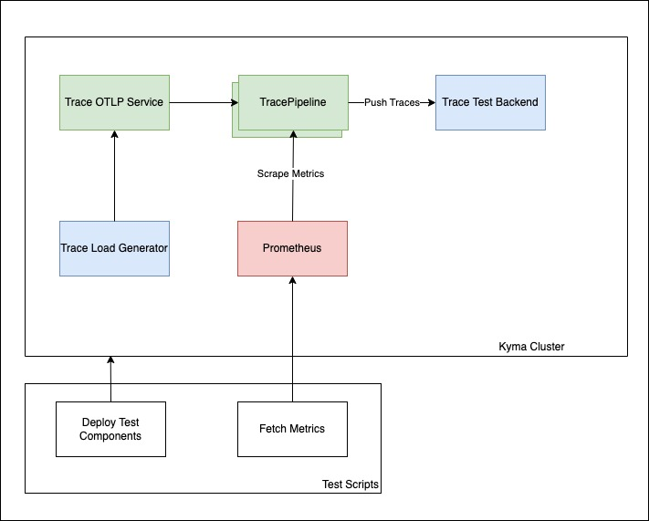

# Traces KPIs and Limit Test

This document describes a reproducible test setup to determine the limits and KPis of the Kyma TracePipeline.

## Prerequisites

- Kyma as the target deployment environment, 2 Nodes with 4 CPU and 16G Memory (n1-standard-4 on GCP)
- Telemetry Module installed
- Istio Module installed
- Kubectl > 1.22.x
- Helm 3.x
- curl 8.4.x
- jq 1.6

## Test Cases

### Assumptions

The tests are executed for 20 minutes for each test case to have a stabilized output and reliable KPIs. Generated traces contains at least 2 spans and each span have 40 attributes to simulate an average trace span size.  

Following test cases identified:

1. Test average throughput end-to-end. 
2. Test queuing and retry capabilities of TracePipeline with simulated backend outages.
3. Test average throughput with 3 TracePipelines simultaneously end-to-end.
4. Test queuing and retry capabilities of 3 TracePipeline with simulated backend outages.


## Setup

The following diagram shows test setup used for all test cases. 



In all test scenarios a preconfigured trace load generator deployed on test cluster, the trace load generator feed test TracePipeline over pipeline service instance to ensure all trace gateway instances get loaded with test data.

A prometheus instance deployed on test cluster, to collect relevant metrics from trace gateway instances and fetch this metrics end of test as test scenario result.

All test scenarios also get a Trace Test Backend deployed on test cluster to simulate end-to-end behaviour.

Each test scenario has own test scripts responsible for preparing test scenario and deploying on test cluster, run the scenario, and fetch relevant metrics/KPIs end of test run. The test results end of test stored in a dedicated file for each scenario, the result file name contains tested OpenTelemetry Image version and scenario name (e.g. otel-0.89.0_traces_load_test.csv), test result file stores measured KPIs in csv format with KPI name and value.

A typical test result file will look like following:

```csv
"Receiver accepted spans","Average","20211.2"
"Exporter exported spans","Average","20224"
"Exporter queue size","Average","0"
"Pod memory","telemetry-trace-collector-c54dcb8c4-f2rjp","69361664"
"Pod memory","telemetry-trace-collector-c54dcb8c4-2fjzn","61722624"
```

## Test Scripts

1. To run test case Test average throughput end-to-end, execute [run-load-test.sh](assets%2Frun-load-test.sh)
2. To run test case Test queuing and retry capabilities of TracePipeline with simulated backend outages, execute [run-backpressure-test.sh](assets%2Frun-backpressure-test.sh)
3. To run test case Test average throughput with 3 TracePipelines simultaneously end-to-end, execute [run-maxpipeline-load-test.sh](assets%2Frun-maxpipeline-load-test.sh)
4. To run test case Test queuing and retry capabilities of 3 TracePipeline with simulated backend outages, execute [run-maxpipeline-backpressure-test.sh](assets%2Frun-maxpipeline-backpressure-test.sh)


